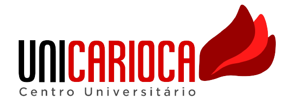

<p align="center">
  
</p>

<br>

## 💻 Technologies

Technologies used for the construction of this project:

- [React](https://reactjs.org)
- [React Router Dom](https://reactrouter.com/en/main)
- [Vite Starter](https://vitejs.dev/)

## 🚀 Getting started

**You need to have node installed on your machine**

Clone the project and access the folder.

```bash
$ git clone https://github.com/marcosdoriguetto/aps-dev-web.git
$ cd aps-dev-web
```

Follow the steps below:

```bash
# Install the dependencies
$ npm install

# Start the project
$ npm run dev
```

The app will be available for access on your browser at http://localhost:3000

## 📝 License

This project is licensed under the MIT License. See the [LICENSE](LICENSE.md) file for details.

---

<p align="center">Made with 💜 by Marcos, Filipe, Mateus, Samuel</p>
